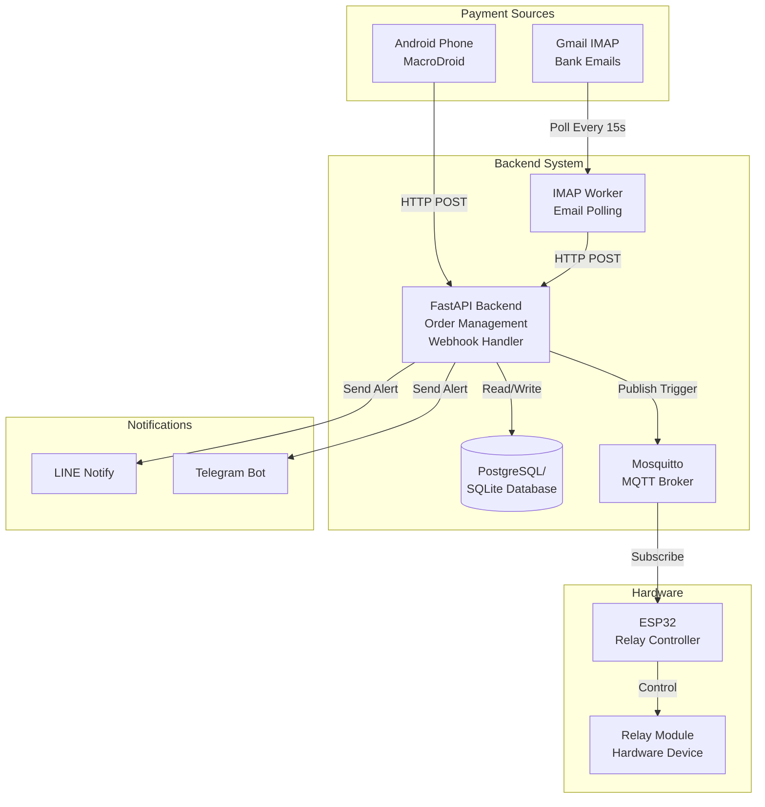

# PromptPay Semi-Automated Payment Verification & Hardware Trigger

ระบบตรวจสอบการชำระเงิน PromptPay แบบกึ่งอัตโนมัติ พร้อมระบบควบคุมอุปกรณ์ฮาร์ดแวร์ (ESP32)

**Production-grade Thai PromptPay payment verification system with hardware trigger capabilities**

---

## 📋 Table of Contents

- [Overview](#overview)
- [Architecture](#architecture)
- [Features](#features)
- [Prerequisites](#prerequisites)
- [Quick Start](#quick-start)
- [Configuration](#configuration)
- [API Documentation](#api-documentation)
- [MacroDroid Setup](#macrodroid-setup)
- [IMAP Setup](#imap-setup)
- [ESP32 Setup](#esp32-setup)
- [Running Tests](#running-tests)
- [Deployment](#deployment)
- [Security Considerations](#security-considerations)
- [Troubleshooting](#troubleshooting)

---

## Overview

ระบบนี้ออกแบบมาเพื่อรองรับการตรวจสอบการชำระเงินผ่าน PromptPay และบัญชีธนาคารไทยแบบกึ่งอัตโนมัติ โดยสามารถ:

- สร้างออเดอร์พร้อมจำนวนเงินแบบ Random Cent (เช่น 100.25, 100.47) เพื่อป้องกันการชนกันของออเดอร์
- รับข้อมูลการแจ้งเตือนจากธนาคารผ่าน Android (MacroDroid) หรือ Email (Gmail IMAP)
- จับคู่การชำระเงินกับออเดอร์โดยอัตโนมัติ
- ควบคุมอุปกรณ์ฮาร์ดแวร์ (Relay) ผ่าน ESP32 via MQTT
- แจ้งเตือนเจ้าของร้านผ่าน LINE Notify หรือ Telegram

**This system is NOT a bank-certified payment gateway. It's a semi-automated verification tool for merchant use.**

---

## Architecture



### Component Responsibilities

1. **FastAPI Backend**: Order creation, webhook handling, transaction matching, dispatch
2. **IMAP Worker**: Poll Gmail for bank notifications, extract and forward to webhook
3. **Database**: Store orders and transactions (SQLite for dev, PostgreSQL for production)
4. **MQTT Broker**: Message queue for triggering hardware devices
5. **ESP32 Firmware**: Subscribe to MQTT, activate relay on payment confirmation
6. **Notification Services**: Alert merchant via LINE Notify or Telegram

---

## Features

### ✅ Order Management
- Random cent matching (100.01 - 100.99) for unique order identification
- Automatic collision avoidance among active unpaid orders
- 10-minute TTL with automatic expiration
- Customer reference and metadata support

### ✅ Bank Notification Parsing
- Support for SCB, KBank, KTB, PromptPay notification formats
- Regex-based extraction: amount, date, time, reference
- Thai Buddhist calendar support (พ.ศ. → ค.ศ.)
- Extensible pattern system

### ✅ Transaction Matching
- Exact amount matching with time window validation
- Duplicate notification prevention
- Idempotent webhook handling
- Most-recent order priority

### ✅ Hardware Integration
- MQTT publish to ESP32 devices
- JSON payload with order details
- Configurable relay trigger duration
- Auto-reconnect support

### ✅ Multi-Channel Notifications
- LINE Notify with customizable messages
- Telegram bot integration
- Async notification dispatch

### ✅ Security
- API key authentication for order endpoints
- Webhook secret validation
- No hardcoded credentials
- Environment-based configuration

---

## Prerequisites

### For Backend Development
- Python 3.11+
- PostgreSQL 15+ (or SQLite for local dev)
- Mosquitto MQTT Broker
- Docker & Docker Compose (recommended)

### For Android Notification Forwarding
- Android phone with **MacroDroid** app (Pro version recommended)
- Notification access permission

### For Email Forwarding
- Gmail account with **App Password** enabled
- IMAP access enabled

### For ESP32 Hardware
- ESP32 development board
- Arduino IDE with ESP32 board support
- Relay module (active HIGH recommended)
- Wi-Fi network

---

## Quick Start

### 1. Clone Repository

```bash
git clone https://github.com/your-org/iot23.git
cd iot23
```

### 2. Configure Environment

```bash
cp .env.example .env
# Edit .env with your configuration
```

**Minimum required configuration:**
```env
API_KEY=your-secure-api-key
WEBHOOK_SECRET=your-webhook-secret
DATABASE_URL=sqlite:///./payment_verification.db
```

### 3. Run with Docker Compose (Recommended)

```bash
# Start API + MQTT + PostgreSQL
docker-compose up -d

# View logs
docker-compose logs -f api
```

API will be available at `http://localhost:8000`

### 4. Run Locally (Alternative)

```bash
# Install dependencies
pip install -r requirements.txt

# Start MQTT broker (separate terminal)
mosquitto -c /usr/local/etc/mosquitto/mosquitto.conf

# Start API
uvicorn app.main:app --reload
```

### 5. Run Tests

```bash
pytest tests/ -v
```

---

## Configuration

### Environment Variables

See `.env.example` for full configuration options.

#### Core Settings

| Variable | Description | Default |
|----------|-------------|---------|
| `DATABASE_URL` | Database connection string | `sqlite:///./payment_verification.db` |
| `API_KEY` | API key for protected endpoints | Required |
| `WEBHOOK_SECRET` | Secret for webhook authentication | Required |
| `ORDER_TTL_MINUTES` | Order expiration time | `10` |

#### MQTT Settings

| Variable | Description | Default |
|----------|-------------|---------|
| `MQTT_BROKER` | MQTT broker hostname/IP | `localhost` |
| `MQTT_PORT` | MQTT broker port | `1883` |
| `MQTT_TOPIC_TRIGGER` | Topic for payment triggers | `device/payment/trigger` |
| `MQTT_USERNAME` | MQTT username (optional) | - |
| `MQTT_PASSWORD` | MQTT password (optional) | - |

#### Notification Settings

| Variable | Description | Default |
|----------|-------------|---------|
| `LINE_NOTIFY_TOKEN` | LINE Notify access token | - |
| `LINE_NOTIFY_ENABLED` | Enable LINE notifications | `false` |
| `TELEGRAM_BOT_TOKEN` | Telegram bot token | - |
| `TELEGRAM_CHAT_ID` | Telegram chat ID | - |
| `TELEGRAM_ENABLED` | Enable Telegram notifications | `false` |

#### IMAP Worker Settings

| Variable | Description | Default |
|----------|-------------|---------|
| `IMAP_SERVER` | IMAP server hostname | `imap.gmail.com` |
| `IMAP_PORT` | IMAP server port | `993` |
| `IMAP_EMAIL` | Gmail address | Required for worker |
| `IMAP_PASSWORD` | Gmail App Password | Required for worker |
| `IMAP_POLL_INTERVAL` | Poll interval in seconds | `15` |

---

## API Documentation

### Base URL
```
http://localhost:8000
```

### Authentication

All protected endpoints require `X-API-Key` header:
```bash
curl -H "X-API-Key: your-api-key" http://localhost:8000/orders/
```

Webhook endpoints require `X-Webhook-Secret` header.

### Endpoints

#### Health Check
```http
GET /health
```
**Response:**
```json
{
  "status": "healthy",
  "mqtt_connected": true
}
```

#### Create Order
```http
POST /orders/
Content-Type: application/json
X-API-Key: your-api-key

{
  "base_amount": 100.0,
  "customer_ref": "CUST-12345",
  "metadata": "{\"product\": \"coffee\"}"
}
```

**Response (201 Created):**
```json
{
  "id": 1,
  "base_amount": 100.0,
  "expected_amount": 100.47,
  "status": "PENDING",
  "created_at": "2024-01-15T10:30:00",
  "expires_at": "2024-01-15T10:40:00",
  "paid_at": null,
  "customer_ref": "CUST-12345",
  "metadata": "{\"product\": \"coffee\"}"
}
```

**Tell customer to transfer exactly `100.47 THB`**

#### Get Order
```http
GET /orders/{order_id}
X-API-Key: your-api-key
```

#### Cancel Order
```http
POST /orders/{order_id}/cancel
X-API-Key: your-api-key
```

#### Bank Notification Webhook
```http
POST /webhook/bank-notification
Content-Type: application/json
X-Webhook-Secret: your-webhook-secret

{
  "notification_text": "SCB: รับเงิน 100.47 บาท 15/01/67 10:35",
  "source": "macrodroid",
  "timestamp": "2024-01-15T10:35:00Z"
}
```

**Response (200 OK):**
```json
{
  "success": true,
  "message": "Payment matched and processed",
  "transaction_id": 1,
  "order_id": 1,
  "matched": true
}
```

When matched, the system will:
1. Mark order as PAID
2. Publish MQTT trigger to ESP32
3. Send LINE/Telegram notification

---

## MacroDroid Setup

**MacroDroid** is an Android automation app that can forward bank notifications to your webhook.

### Step-by-Step Setup

#### 1. Install MacroDroid
- Download from Google Play Store
- Grant all required permissions
- **Enable Notification Access** in Android settings

#### 2. Create New Macro

**Trigger: Notification**
- Trigger Type: `Notification`
- Applications: Select your banking apps (e.g., SCB Easy, K PLUS, KTB Netbank)
- Notification Options: 
  - ✅ Get Notification Text
  - ✅ Include Title

**Action: HTTP Request**
- Method: `POST`
- URL: `https://your-server.com/webhook/bank-notification`
- Content Type: `application/json`
- Headers:
  ```
  X-Webhook-Secret: your-webhook-secret
  ```
- Request Body:
  ```json
  {
    "notification_text": "{notification_title} {notification_text}",
    "source": "macrodroid",
    "timestamp": "{lv=date_time_iso}"
  }
  ```

**Settings:**
- Replace `{notification_title}` → MacroDroid magic text: `Notification Title`
- Replace `{notification_text}` → MacroDroid magic text: `Notification Text`
- Replace `{lv=date_time_iso}` → MacroDroid magic text: `Date/Time ISO`

#### 3. Test Macro
- Trigger a test notification from your bank app
- Check MacroDroid log
- Verify webhook receives POST request

#### 4. Important Notes
- Keep MacroDroid running in background
- Disable battery optimization for MacroDroid
- Test with actual bank notifications
- Some banks may split notifications - adjust trigger filters accordingly

### Example MacroDroid JSON Export
```json
{
  "trigger": {
    "type": "notification",
    "apps": ["com.scb.phone", "com.kasikorn.retail.mbanking.wap"],
    "get_text": true,
    "get_title": true
  },
  "actions": [
    {
      "type": "http_request",
      "method": "POST",
      "url": "https://your-server.com/webhook/bank-notification",
      "content_type": "application/json",
      "headers": {
        "X-Webhook-Secret": "your-webhook-secret"
      },
      "body": "{\"notification_text\":\"{notification_title} {notification_text}\",\"source\":\"macrodroid\",\"timestamp\":\"{lv=date_time_iso}\"}"
    }
  ]
}
```

---

## IMAP Setup

The IMAP worker polls your Gmail inbox for bank notification emails.

### Gmail Configuration

#### 1. Enable IMAP in Gmail
- Go to Gmail Settings → Forwarding and POP/IMAP
- **Enable IMAP**
- Save changes

#### 2. Create App Password
- Go to Google Account → Security
- Enable **2-Step Verification** (required)
- Go to **App Passwords**
- Select app: `Mail`, device: `Other (Custom name)`
- Enter name: `PromptPay IMAP`
- Copy the 16-character password

#### 3. Configure Environment
```env
IMAP_EMAIL=your-email@gmail.com
IMAP_PASSWORD=your-app-password-here
IMAP_SERVER=imap.gmail.com
IMAP_PORT=993
IMAP_POLL_INTERVAL=15
```

#### 4. Run IMAP Worker

**With Docker Compose:**
```bash
docker-compose --profile with-worker up -d
```

**Standalone:**
```bash
python worker/imap_worker.py
```

#### 5. Test
- Send yourself a test bank notification email
- Worker should detect and forward it within 15 seconds
- Check logs: `docker-compose logs -f worker`

### Supported Banks
The worker detects emails containing Thai bank keywords:
- รับเงิน, รับโอน, โอนเข้า
- SCB, กสิกร, K-Mobile, KTB, PromptPay

---

## ESP32 Setup

### Hardware Requirements
- ESP32 development board (ESP32-DevKitC or similar)
- Relay module (5V, Active HIGH recommended)
- Power supply (5V/1A minimum)
- Jumper wires

### Wiring Diagram
```
ESP32          Relay Module
-----          ------------
GPIO 2  -----> IN (Signal)
GND     -----> GND
3.3V    -----> VCC (if relay is 3.3V compatible)
                or
5V      -----> VCC (if relay needs 5V)
```

### Software Setup

#### 1. Install Arduino IDE
- Download from https://www.arduino.cc/
- Install ESP32 board support:
  - File → Preferences → Additional Board Manager URLs:
  ```
  https://raw.githubusercontent.com/espressif/arduino-esp32/gh-pages/package_esp32_index.json
  ```
  - Tools → Board → Boards Manager → Search "ESP32" → Install

#### 2. Install Required Libraries
Tools → Manage Libraries:
- **PubSubClient** by Nick O'Leary
- **ArduinoJson** by Benoit Blanchon

#### 3. Configure Secrets
```bash
cd firmware/payment_trigger
cp secrets.h.example secrets.h
```

Edit `secrets.h`:
```cpp
#define WIFI_SSID "Your-WiFi-Name"
#define WIFI_PASSWORD "Your-WiFi-Password"
#define MQTT_BROKER "192.168.1.100"  // Your server IP
#define MQTT_PORT 1883
#define MQTT_USERNAME ""  // Optional
#define MQTT_PASSWORD ""  // Optional
#define MQTT_TOPIC_TRIGGER "device/payment/trigger"
```

#### 4. Upload Firmware
- Connect ESP32 via USB
- Tools → Board → ESP32 Dev Module
- Tools → Port → (Select your ESP32 port)
- Upload sketch: `Sketch → Upload`

#### 5. Monitor Serial Output
- Tools → Serial Monitor (115200 baud)
- Should see:
  ```
  Connecting to Wi-Fi...
  Wi-Fi connected!
  IP Address: 192.168.1.150
  Connecting to MQTT broker... Connected!
  Subscribed to: device/payment/trigger
  Waiting for payment triggers...
  ```

### Testing ESP32

Publish test MQTT message:
```bash
mosquitto_pub -h localhost -t device/payment/trigger -m '{
  "order_id": 1,
  "amount": 100.47,
  "paid_at": "2024-01-15T10:35:00",
  "timestamp": "2024-01-15T10:35:00"
}'
```

ESP32 should:
1. Receive message
2. Activate relay (GPIO HIGH)
3. Wait 5 seconds
4. Deactivate relay (GPIO LOW)

### Pin Configuration

Default pin: `GPIO 2` (built-in LED on most boards)

To change relay pin, edit in `.ino`:
```cpp
#define GPIO_RELAY_PIN 2  // Change to your pin
```

Common GPIO options: 2, 4, 5, 12, 13, 14, 15, 16, 17, 18, 19, 21, 22, 23

⚠️ **Avoid:** GPIO 0, 1, 3, 6-11 (boot/flash pins)

---

## Running Tests

### Run All Tests
```bash
pytest tests/ -v
```

### Run Specific Test File
```bash
pytest tests/test_extractor.py -v
```

### Run with Coverage
```bash
pytest tests/ --cov=app --cov-report=html
```

### Test Suites

#### `test_extractor.py`
- Tests Thai bank notification regex patterns
- SCB, KBank, KTB, PromptPay formats
- Date/time parsing with Buddhist calendar
- Reference number extraction

#### `test_matcher.py`
- Transaction-to-order matching logic
- Duplicate detection
- Time window validation
- Order priority selection

#### `test_orders.py`
- Order creation with random cents
- Collision avoidance
- Order expiration
- Cancellation logic

---

## Deployment

### Docker Compose (Production)

```bash
# Clone repository
git clone https://github.com/your-org/iot23.git
cd iot23

# Configure environment
cp .env.example .env
# Edit .env with production values

# Start services
docker-compose up -d

# Check logs
docker-compose logs -f

# Stop services
docker-compose down
```

### Systemd Service (Linux)

Create `/etc/systemd/system/promptpay-api.service`:
```ini
[Unit]
Description=PromptPay Payment Verification API
After=network.target postgresql.service mosquitto.service

[Service]
Type=simple
User=www-data
WorkingDirectory=/opt/iot23
Environment="PATH=/opt/iot23/venv/bin"
ExecStart=/opt/iot23/venv/bin/uvicorn app.main:app --host 0.0.0.0 --port 8000
Restart=always

[Install]
WantedBy=multi-user.target
```

Enable and start:
```bash
sudo systemctl daemon-reload
sudo systemctl enable promptpay-api
sudo systemctl start promptpay-api
```

### Nginx Reverse Proxy

```nginx
server {
    listen 80;
    server_name your-domain.com;

    location / {
        proxy_pass http://127.0.0.1:8000;
        proxy_set_header Host $host;
        proxy_set_header X-Real-IP $remote_addr;
        proxy_set_header X-Forwarded-For $proxy_add_x_forwarded_for;
    }
}
```

---

## Security Considerations

⚠️ **This system is NOT a bank-certified payment gateway.**

### Best Practices

1. **Use Strong Secrets**
   - Generate random API keys and webhook secrets
   - Use `openssl rand -hex 32` to generate secure keys
   - Never commit secrets to version control

2. **HTTPS Only in Production**
   - Use SSL/TLS certificates (Let's Encrypt)
   - Never send secrets over HTTP
   - Configure MacroDroid with HTTPS webhook URL

3. **Database Security**
   - Use PostgreSQL with strong password
   - Enable database encryption at rest
   - Regular backups

4. **MQTT Security**
   - Enable MQTT authentication (username/password)
   - Use TLS/SSL for MQTT connections
   - Restrict MQTT access by IP if possible

5. **Network Security**
   - Use firewall to restrict API access
   - Whitelist MacroDroid/worker IP addresses
   - Consider VPN for ESP32 devices

6. **Rate Limiting**
   - Implement rate limiting on webhook endpoint
   - Use Nginx or API gateway

7. **Logging & Monitoring**
   - Monitor for suspicious transactions
   - Alert on repeated failed authentication
   - Regular log review

### Known Limitations

- ❌ Not PCI-DSS compliant
- ❌ No bank-grade encryption
- ❌ Manual intervention may be required
- ❌ False positives possible with regex patterns
- ❌ Relies on notification text formats (bank may change)

**Use at your own risk. Verify all transactions manually for critical operations.**

---

## Troubleshooting

### API Issues

**API won't start:**
```bash
# Check logs
docker-compose logs api

# Common issues:
# 1. Database connection failed
# 2. MQTT broker unreachable
# 3. Port 8000 already in use
```

**Database connection error:**
```bash
# Check PostgreSQL is running
docker-compose ps postgres

# Test connection
docker-compose exec postgres psql -U promptpay -d payment_verification
```

### MQTT Issues

**MQTT not connecting:**
```bash
# Check broker is running
docker-compose ps mosquitto

# Test MQTT connection
mosquitto_sub -h localhost -t device/payment/trigger -v
```

**ESP32 not receiving messages:**
- Check Wi-Fi connection
- Verify MQTT broker IP in secrets.h
- Check MQTT topic matches (case-sensitive)
- Monitor serial output for errors

### MacroDroid Issues

**Notifications not forwarding:**
1. Check notification access permission
2. Verify correct bank apps selected
3. Test with manual notification
4. Check MacroDroid logs
5. Verify webhook URL is accessible
6. Check webhook secret matches

**HTTP request fails:**
- Ensure phone has internet
- Test webhook URL in browser
- Check firewall rules
- Verify SSL certificate (for HTTPS)

### IMAP Worker Issues

**Worker not connecting:**
```bash
# Check credentials
docker-compose logs worker

# Common issues:
# 1. Invalid App Password
# 2. IMAP not enabled
# 3. 2FA not configured
```

**No emails detected:**
- Check IMAP_MAILBOX setting (usually "INBOX")
- Verify bank sends email notifications
- Check email is not in Spam
- Look for keywords in worker logs

### Extraction Issues

**Notification not parsed:**
- Check notification text format
- Add debug logging in extractor
- Add new regex pattern if needed
- Test with `test_extractor.py`

**Wrong date/time:**
- Verify Buddhist/CE year conversion
- Check timezone settings
- Adjust datetime parsing logic

### Order Matching Issues

**Payment not matched:**
1. Check exact amount matches (with cents)
2. Verify order is not expired
3. Check time window setting
4. Look for duplicate transactions
5. Review matcher logs

**Multiple orders with same amount:**
- Should not happen if system is working
- Run order expiration job
- Check collision avoidance logic

---

## License

MIT License - See LICENSE file for details

---

## Support

For issues and questions:
- GitHub Issues: https://github.com/your-org/iot23/issues
- Email: support@your-domain.com

---

## Contributors

- Your Team

---

**🇹🇭 Made for Thai merchants | ทำเพื่อร้านค้าคนไทย**
